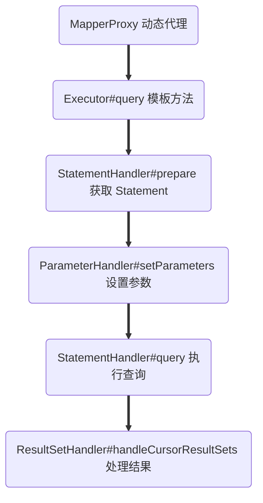

# MyBatis 原理

## 初始化阶段

MyBatis 简单使用如下：

```java
public class Main {
    public static void main(String[] args) throws Exception {
        String resource = "mybatis-config.xml";
        InputStream inputStream = Resources.getResourceAsStream(resource);
        SqlSessionFactory sqlSessionFactory = new SqlSessionFactoryBuilder().build(inputStream);

        try (SqlSession session = sqlSessionFactory.openSession()) {
            UserMapper mapper = session.getMapper(UserMapper.class);
            System.out.println(mapper.getUser("lsr"));
        }
    }
}
```

其启动时核心的逻辑在于 `sqlSessionFactory.openSession()` 这一行代码，`SqlSessionFactory` 是一个工厂，在 `build` 时创建了 XML 解析器，解析 XML 中的每一个属性，封装为 `Configuration` 类保存在 `SqlSessionFactory`  中。

```java
public SqlSessionFactory build(InputStream inputStream, String environment, Properties properties) {
    SqlSessionFactory var5;
    try {
        XMLConfigBuilder parser = new XMLConfigBuilder(inputStream, environment, properties);
        var5 = this.build(parser.parse());	// xml 解析属性
    } catch (Exception var14) {
        throw ExceptionFactory.wrapException("Error building SqlSession.", var14);
    } 
    return var5;
}

public Configuration parse() {
    if (this.parsed) {
        throw new BuilderException("Each XMLConfigBuilder can only be used once.");
    } else {
        this.parsed = true;
        this.parseConfiguration(this.parser.evalNode("/configuration"));
        return this.configuration;
    }
}	
```

我们只需要知道这个  `Configuration`  包含了 XML 的全部属性即可，后面还会涉及到此类。


## 执行阶段

### 创建会话

首先来看 open 的逻辑：

```java
private SqlSession openSessionFromDataSource(ExecutorType execType, TransactionIsolationLevel level, boolean autoCommit) {
    Transaction tx = null;

    DefaultSqlSession var8;
    try {
        // 获取执行环境
        Environment environment = this.configuration.getEnvironment();
        
        // 创建事务信息
        TransactionFactory transactionFactory = this.getTransactionFactoryFromEnvironment(environment);
        tx = transactionFactory.newTransaction(environment.getDataSource(), level, autoCommit);
        
        // 获取执行器
        Executor executor = this.configuration.newExecutor(tx, execType);
        var8 = new DefaultSqlSession(this.configuration, executor, autoCommit);
    } catch (Exception var12) {
        this.closeTransaction(tx);
        throw ExceptionFactory.wrapException("Error opening session.  Cause: " + var12, var12);
    } 

    return var8;
}
```

这里的 Transaction 只是封装了数据源、隔离级别等事务信息，并没有真正开启连接。

执行器 Executor 是 Mybatis 中的一个重要的类：

```java
public Executor newExecutor(Transaction transaction, ExecutorType executorType) {
  Executor executor;
  if (ExecutorType.BATCH == executorType) {
    executor = new BatchExecutor(this, transaction);
  } else if (ExecutorType.REUSE == executorType) {
    executor = new ReuseExecutor(this, transaction);
  } else {
    executor = new SimpleExecutor(this, transaction);
  }
  if (cacheEnabled) {
    executor = new CachingExecutor(executor);
  }
  executor = (Executor) interceptorChain.pluginAll(executor);
  return executor;
}
```

从代码中可以看出，执行器主要分为四大类，主要区别如下：

- BatchExecutor：缓存 SQL 并批量执行。
- ReuseExecutor：复用 Statement，以 SQL 为 key，从缓存 Map<String, Statement> 中取 Statement 对象，使用完后放置缓存。
- SimpleExecutor：每次使用时都会创建 Statement，每次执行一次 SQL。
- CachingExecutor：组合上诉三种执行器，以 SQL 为 key，缓存结果。

> **JDBC 中的 Statement**：一旦我们获得了数据库的连接，我们就可以和数据库进行交互，一个 Statement 就是一个连接，JDBC 的 Statement，CallableStatement 和 PreparedStatement 接口定义的方法和属性，可以让你发送 SQL 命令或 PL/SQL 命令到数据库，并从你的数据库接收数据。
>
> | 接口              | 推荐使用                                                     |
> | :---------------- | :----------------------------------------------------------- |
> | Statement         | 可以正常访问数据库，适用于运行静态 SQL 语句。 Statement 接口不接受参数。 |
> | PreparedStatement | 计划多次使用 SQL 语句， PreparedStatement 接口运行时接受输入的参数，可防止 SQL 注入。 |
> | CallableStatement | 适用于当你要访问数据库存储过程的时候， CallableStatement 接口运行时也接受输入的参数。 |

上述还涉及到插件的加载，下文再讲。

### 动态代理

此处我们的 UserMapper 仅仅只是个接口，为什么可以执行 SQL 呢？没错，就是动态代理技术！

这个代理类为 `class MapperProxy<T> implements InvocationHandler`，透过 `getMapper` 这个方法，可以跟踪到源码：

```java
protected T newInstance(MapperProxy<T> mapperProxy) {
  return (T) Proxy.newProxyInstance(mapperInterface.getClassLoader(), new Class[] { mapperInterface }, mapperProxy);
}

public T newInstance(SqlSession sqlSession) {
  final MapperProxy<T> mapperProxy = new MapperProxy<T>(sqlSession, mapperInterface, methodCache);
  return newInstance(mapperProxy);
}
```

这其实就是 JDK 的动态代理，那么我们所执行的任何方法都是通过 MapperProxy.invoke 这个方法完成的。


### 核心逻辑

进入到 MapperProxy.invoke 方法内，这个方法主要是调用了 `MapperMethod.execute` 方法：

```java
@Override
public Object invoke(Object proxy, Method method, Object[] args) throws Throwable {
  final MapperMethod mapperMethod = cachedMapperMethod(method);
  return mapperMethod.execute(sqlSession, args);
}
```

并且会将 MapperMethod 实例缓存起来，避免频繁创建对象，MapperMethod 是 Mapper 类中的一个方法具体的执行逻辑，进入到他的执行方法：

```java
public Object execute(SqlSession sqlSession, Object[] args) {
  Object result;
  switch (command.getType()) {
    case INSERT: {
    Object param = method.convertArgsToSqlCommandParam(args);
      result = rowCountResult(sqlSession.insert(command.getName(), param));
      break;
    }
    case UPDATE: {
      Object param = method.convertArgsToSqlCommandParam(args);
      result = rowCountResult(sqlSession.update(command.getName(), param));
      break;
    }
    case DELETE: {
      Object param = method.convertArgsToSqlCommandParam(args);
      result = rowCountResult(sqlSession.delete(command.getName(), param));
      break;
    }
    case SELECT:
      if (method.returnsMany()) {
        result = executeForMany(sqlSession, args);
      } else if (method.returnsMap()) {
        result = executeForMap(sqlSession, args);
      } else if (method.returnsCursor()) {
        result = executeForCursor(sqlSession, args);
      } else {
        Object param = method.convertArgsToSqlCommandParam(args);
        result = sqlSession.selectOne(command.getName(), param);
      }
      break;
    case FLUSH:
      result = sqlSession.flushStatements();
      break;
    default:
      throw new BindingException("Unknown execution method for: " + command.getName());
  }
  return result;
}
```

这个方法是一个中间方法，透过 SELECT 跟踪源码，最终会调用到 `Executor#doQuery` 方法， Executor 类型上面介绍过了，这里可能是三种 Executor 中的任意一种（Cache 依赖其他三种），这依赖与具体的环境与配置。

```java
@Override
public <E> List<E> doQuery(MappedStatement ms, Object parameter, RowBounds rowBounds, ResultHandler resultHandler, BoundSql boundSql) throws SQLException {
    // 获取配置
    Configuration configuration = ms.getConfiguration();
    // 创建 StatementHandler
    StatementHandler handler = configuration.newStatementHandler(wrapper, ms, parameter, rowBounds, resultHandler, boundSql);
    // 参数准备，创建 JDBC 中的 Statement，这是与 jdk 交互的地方
    Statement stmt = prepareStatement(handler, ms.getStatementLog());
    // 使用 jdbc 执行方法与结果处理
    return handler.<E>query(stmt, resultHandler);
}
```

`configuration.newStatementHandler` 方法创建了 StatementHandler，负责与 jdk Statement 交互，在创建时，会向上调用 `BaseStatementHandler` 的无参构造器，这个构造器里会调用 `Configuration` 中的方法初始化 `ParameterHandler、ResultSetHandler`:

```java
public StatementHandler newStatementHandler(Executor executor, MappedStatement mappedStatement, Object parameterObject, RowBounds rowBounds, ResultHandler resultHandler, BoundSql boundSql) {
    StatementHandler statementHandler = new RoutingStatementHandler(executor, mappedStatement, parameterObject, rowBounds, resultHandler, boundSql);
    statementHandler = (StatementHandler) interceptorChain.pluginAll(statementHandler);
    return statementHandler;
}

public ParameterHandler newParameterHandler(MappedStatement mappedStatement, Object parameterObject, BoundSql boundSql) {
  ParameterHandler parameterHandler = mappedStatement.getLang().createParameterHandler(mappedStatement, parameterObject, boundSql);
  parameterHandler = (ParameterHandler) interceptorChain.pluginAll(parameterHandler);
  return parameterHandler;
}

public ResultSetHandler newResultSetHandler(Executor executor, MappedStatement mappedStatement, RowBounds rowBounds, ParameterHandler parameterHandler,
    ResultHandler resultHandler, BoundSql boundSql) {
  ResultSetHandler resultSetHandler = new DefaultResultSetHandler(executor, mappedStatement, parameterHandler, resultHandler, boundSql, rowBounds);
  resultSetHandler = (ResultSetHandler) interceptorChain.pluginAll(resultSetHandler);
  return resultSetHandler;
}
```

可以看到都使用了拦截器进行封装，下文会说到拦截器的工作原理。

`doQuery` 方法是一个模板方法，包含了 MyBatis 执行 SQL 的核心逻辑，这里总结一下：



## 拦截器

拦截器是 Mybatis 里一个非常重要的知识点，拦截器可以在 Mybatis 特定流程处执行自己的逻辑，根据上诉可知，拦截器主要有四种，分别作用于 `Executor、StatementHandler、ParameterHandler、ResultSetHandler` 四个类上，并将原来的实例用拦截器替代。

```java
public Object pluginAll(Object target) {
  for (Interceptor interceptor : interceptors) {
    target = interceptor.plugin(target);
  }
  return target;
}
```

拦截器的接口为：

```java
public interface Interceptor {
  Object intercept(Invocation invocation) throws Throwable;

  Object plugin(Object target);

  void setProperties(Properties properties);
}
```

来看一个简单的例子，这个拦截器拦截 `ParameterHandler#setParameters` 方法，并将参数强制改为 `lsr` 字符串：

```java
@Intercepts({
        @Signature(type = ParameterHandler.class, method = "setParameters", args = PreparedStatement.class),
})
public class ParameterInterceptor implements Interceptor {
    @Override
    public Object intercept(Invocation invocation) throws Throwable {
        if (invocation.getTarget() instanceof ParameterHandler ph) {
            Field parameter = ph.getClass().getDeclaredField("parameterObject");
            parameter.setAccessible(true);
            parameter.set(ph, "lsr");
        }
        return invocation.proceed();
    }

    @Override
    public Object plugin(Object o) {
        return Plugin.wrap(o, this);
    }

    @Override
    public void setProperties(Properties properties) {
    }
}
```

这样即使我们传入的参数不是 "lsr"，查询时却会以 "lsr" 进行查询：


这个关键在于 @Intercepts 注解和 `Plugin.wrap` 方法，`Plugin` 方法本身就实现了 `InvocationHandler` 接口，可见这是一个代理类，拦截器的核心逻辑就在这个类中。

```java
@Override
public Object invoke(Object proxy, Method method, Object[] args) throws Throwable {
  try {
    Set<Method> methods = signatureMap.get(method.getDeclaringClass());
    if (methods != null && methods.contains(method)) {
      return interceptor.intercept(new Invocation(target, method, args));
    }
    return method.invoke(target, args);
  } catch (Exception e) {
    throw ExceptionUtil.unwrapThrowable(e);
  }
}
```

可以发现这个类的代理逻辑在于 `if` 语句，如果 `methods` 集合中包含这个方法，则会调用拦截器的方法。那么这个 `methods` 集合是怎么来的呢？

其逻辑在 `warp` 方法内：

```java
public static Object wrap(Object target, Interceptor interceptor) {
  Map<Class<?>, Set<Method>> signatureMap = getSignatureMap(interceptor);
  Class<?> type = target.getClass();
  Class<?>[] interfaces = getAllInterfaces(type, signatureMap);
  if (interfaces.length > 0) {
    return Proxy.newProxyInstance(
        type.getClassLoader(),
        interfaces,
        new Plugin(target, interceptor, signatureMap));
  }
  return target;
}
```

注意 `getSignatureMap` 方法：

```java
private static Map<Class<?>, Set<Method>> getSignatureMap(Interceptor interceptor) {
  // 获取注解
  Intercepts interceptsAnnotation = interceptor.getClass().getAnnotation(Intercepts.class);
  Signature[] sigs = interceptsAnnotation.value();
  Map<Class<?>, Set<Method>> signatureMap = new HashMap<Class<?>, Set<Method>>();
  for (Signature sig : sigs) {
    Set<Method> methods = signatureMap.get(sig.type());
    if (methods == null) {
      methods = new HashSet<Method>();
      signatureMap.put(sig.type(), methods);
    }
    Method method = sig.type().getMethod(sig.method(), sig.args());
    methods.add(method);
  }
  return signatureMap;
}
```

这个方法获取了拦截器类上的注解，获取注解上的 `@Signature`，解析注解并封装至 `SignatureMap` 中。

这便是拦截器的工作原理，请别忘了将拦截器注册到拦截器链中。

目前比较常用的分页插件 `PageHelper` 就是使用了拦截器进行扩展：

```java
@Intercepts(
    {
        @Signature(type = Executor.class, method = "query", args = {MappedStatement.class, Object.class, RowBounds.class, ResultHandler.class}),
        @Signature(type = Executor.class, method = "query", args = {MappedStatement.class, Object.class, RowBounds.class, ResultHandler.class, CacheKey.class, BoundSql.class}),
    }
)
```

其拦截了 `Executor#query` 方法，运行时额外构造 `LIMIT` 字句到 SQL 中。