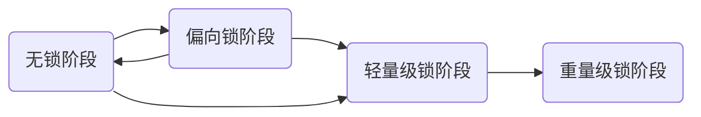

[toc]

文章已收录我的仓库：[Java学习笔记与免费书籍分享](https://github.com/happysnaker/JavaLearningNotes)

# synchronized底层原理

## 前言

在JDK1.5之前，synchronized的实现是依赖于操作系统的，采用的是一种悲观的机制，必须严格保证资源的安全性，因此无论是否存在并发问题，都必须严格的经过获取锁操作，获取锁必须切换至内核态，而当线程尝试获取失败后，必须挂起线程然后切换，休眠或切换线程也都必须切换至内核态由操作系统调度，这种操作是**重量级**的，然而研究者发现绝大多数情况下，并不会存在资源竞争问题，为此，JDK1.6之后对synchronized进行了大量的优化，线程初始抱着乐观的心态进行尝试(不借助OS)，除非迫不得已，线程才会将其托管给操作系统。

本文基于JDK1.6之后的synchronized讲解，synchronized拥有如下几个阶段，其中无锁与偏向锁是同一级别的，**常理上来说锁只能升级不能降级，但后面我们会说到这并不是绝对的：**



使用过synchronized的朋友都知道，synchronized是基于对象锁定的，即使不传入任何参数，synchronized也会自动锁定this，研究synchronized之前有必要研究一下对象的内存布局，因为在对象头中，存在与synchronized相关的信息。

对象头(Object Head)主要分为两个部分，第一个部分是我们着重要研究的，它是实现synchronized的关键，被称作 “Mark Word”，第二部分记载着指向方法区对象类型的指针，这一部分称为 “Class Metdata”，这一部分并不是我们研究的终点。


请注意实际的对象头通常只有 32bit，这意味着 “Mark Word” 字段是复用的，字段修改将会覆盖原来的数据，你完全可以将他理解为C语言中的共用体。

不过，目前大多数机器都是64位的了，这意味着Mark Word字段为64bit，其中主要是线程ID增加到了54位，其余没有改变(1位占位)。

## 无锁

当锁标志位被设置成01且偏向为设置为0，此时对象处于无锁状态，你可能会觉得无锁阶段就是让线程不持有锁而去访问共享资源，但事实上并不是这样如此，无锁会产生并发问题，无锁仅仅是对象初始时的状态，即当对象未使用synchronized或其他并发语句时，对象处于无锁状态。

请注意，无锁与偏向锁是同一级别的，当开启了偏向锁后，新 new 出来的对象将不再是无锁状态，而是直接处于偏向锁状态(在JVM启动时有所不同，JVM启动时延迟开启偏向锁，这一段时间内对象处于无锁)。

## 偏向锁

### 偏向锁的工作原理

当只有一个线程工作时，自然不会发生并发问题，但诸如`StringBuffer`这样的类内部实现几乎每个函数都使用了synchronized标识，而我们通常使用的`String`内部也大量借助了`StringBuffer`类，在JDK1.6以前即使是单线程运行也会造成可怕的性能问题，偏向锁主要用于解决这个问题，即**解决数据在无竞争情况下发生不必要的同步机制，从而提高程序性能。**

偏向锁中的”偏向“意味着这个锁偏向于某一个线程，这个线程往往是第一个使用偏向锁的线程，在这之前，对象要么处于无锁状态，要么处于匿名偏向锁状态。如果在接下来的过程中，一直**没有别的线程申请锁，那么持有偏向锁的线程将不用采用任何的同步机制。**

通过引入偏向锁，在单线程内进行synchronized操作将不会陷入内核申请锁，在前面讲过初始状态下，对象处于匿名偏向状态，此时对象偏向于一个匿名的线程，当第一个线程A调用synchronized语句时，JVM发现对象头中的线程ID为匿名ID，于是JVM记录下该线程A的ID到对象头中，这标志着线程A持有了该对象偏向锁，现在该锁会偏向与线程A，只要是线程A申请锁，JVM会无条件直接放行，而无须由操作系统调度，这大大提高了效率。

一旦线程获取到了偏向锁，**线程会在自己栈帧中创建一个锁记录。**

然而，一旦有其他线程尝试获取偏向锁，如果偏向锁处于非匿名状态，此时 JVM 认为当前环境为并发环境，JVM 会宣告偏向模式结束，升级为轻量级锁（不考虑重偏向）。

**不考虑重偏向的情况下，偏向锁只能偏向一次，因此偏向锁一旦撤销为无锁或升级后，就再也不会进入偏向模式了。**

如果此时线程A仍然处于运行状态，线程 A 必须跑到安全点才能停下来进行偏向锁的撤销(升级)，安全点是会触发GC的必要条件，我没有真正理解为什么要到安全点处停下来，猜测升级锁的过程可能需要暂停所有线程或是需要触发GC(触发GC猜测是有根据的，查看下面打印出的对象头，锁升级时对象的分代年纪增加，由此判断必定发生GC)，因此需要让线程在安全点处停下来。

我们借助JOL工具来打印对象头信息，从而理解偏向锁，考虑如下代码，这里我们显示的添加了参数`-XX:+UseBiasedLocking`强制性要求JVM开启偏向锁:

```java
class A {
    boolean flag = false;
}

public class Test  {

    public static void main(String[] args) {
        A a = new A();
        //该代码表示打印对象头信息，前提是引入了 JOL 依赖
        System.out.println(ClassLayout.parseInstance(a).toPrintable());

        synchronized (a) {
            System.out.println(ClassLayout.parseInstance(a).toPrintable());
        }

        synchronized (a) {
            System.out.println(ClassLayout.parseInstance(a).toPrintable());
        }

        var t = new Thread(new Runnable() {
            @Override
            public void run() {
                synchronized (a) {
                    System.out.println(ClassLayout.parseInstance(a).toPrintable());
                }
            }
        });
        t.start();
        t.join();
    }

}
```

我们直接来看打印出的结果，在此我只将 Mark Word信息展示出来：

| 第几次 |                             说明                             | 线程ID | Epoch(时间戳) | 分代年龄 | 是否可偏向 | 锁标志位 |
| :----: | :----------------------------------------------------------: | :----: | :-----------: | :------: | :--------: | :------: |
| 第一次 | 此时对象刚创建，处于匿名偏向锁状态，可以看到，当线程ID全为0时表示匿名状态 |   ==   |      00       |   0000   |     1      |    01    |
| 第二次 |       此时线程被锁定，进入有名偏向，a对象保存该线程ID        |   T1   |      00       |   0000   |     1      |    01    |
| 第三次 |  对象发现线程ID一致，直接允许线程进入同步代码块，而不陷入OS  |   T1   |      00       |   0000   |     1      |    01    |
| 第四次 | 新的线程想要获取锁，JVM发现该锁处于有名偏向状态，撤销偏向锁，升级为轻量级锁 |   T2   |      ==       |    ==    |     ==     |    00    |

### 批量重偏向

class文件中存在一个计数器，每一次与之关联的对象进行升级或撤销时，都会自增 class 中的计数器，当达到阈值后(默认的是20次)，JVM 认为该类可能频繁的被其他线程访问，于是会允许重偏向，允许对象重新偏向一个线程。

为搞清楚发生了什么，我们来看一个例子：

```java
class A {

}

public class Test  {

    public static void main(String[] args) throws InterruptedException {
        List<A> list = new ArrayList<>();
        var t1 = new Thread(() -> {
            for (int i = 0; i < 30; i++) {
                A a = new A();
                list.add(a);
                synchronized (a) {
                    System.out.println(String.format("T1::%d ", i + 1) + ClassLayout.parseInstance(a).toPrintable());
                }
            }
        });
        t1.start();
        t1.join();

        for (int i = 0; i < 25; i++) {
            A a = list.get(i);
            synchronized (a) {
                System.out.println(String.format("T2::%d ", i + 1) + ClassLayout.parseInstance(a).toPrintable());
            }
        }

        System.out.println(ClassLayout.parseInstance(list.get(25)).toPrintable());

    }
}
```

上面代码中让 t1 执行20次，每次都创建一个新的对象，结果显示，t1 时所有对象都是偏向锁。

t2时，根据规则，偏向锁将会升级为轻量级锁。但注意，由于对象都关联到一个A.class中，经历20次撤销升级后，会触发批量重偏向，通过实践发现 t2 中前 19 次确实升级了锁，但第 20次之后，又变回了偏向锁。


如图，索引 19 的对象使用了轻量级锁，而索引 20 的对象重新使用了偏向锁，偏向了线程二，而后面的元素都使用了偏向锁。

我们还打印了 `list.get(25)` 的对象头，**其仍然处于偏向线程一的状态，释放偏向锁只会释放栈帧中的锁记录而不会修改对象头。**

当然，如果是真正的发生了并发访问，必须要升级锁，批量重偏向和重偏向只是负担。为此，如果在一定时间内，计数器从批量重偏向的起点(20次)增加到了40次，触发新的阈值(默认为40)，此时 JVM 认为对该类的访问可能真正存在并发问题，该类不适合偏向锁，JVM 会自动关闭该类的偏向锁，同时会批量的对锁进行撤销。

### 是否可重偏向

上述我们提到当触发冲偏向阈值时，JVM 是允许重偏向的，现在有个问题，例如在上面的示例中，线程二如何确定线程一是否释放偏向锁呢？如果线程一未仍然持有偏向锁，线程二可不能简单的进行重偏向。

首先可以想到的是，可以扫描对应线程栈帧，查看是否存在锁记录，事实上升级到轻量级锁就是这样做的。

但是这样效率不高，尤其是在 **批量偏向** 的语义下，如果没有一些批量操作，它为什么会被称为 "*批量重偏向*" 呢。

你是否有观察到对象头中 epoch 字段，在与每个对象关联的 Class 信息中，也有一个 epoch 字段。

JVM 是这样做的：**在每次触发批量重偏向时，自增 Class 中的 epoch，同时扫描所有状态为偏向锁的对象头，遍历偏向线程的栈帧，如果存在锁记录，则更新对象头 epoch 与 Class 中的同步。**

现在，仅需要比较对象头 epoch 与 class 中的 epoch 是否相等即可判断。

### 偏向锁升级

如果不考虑重偏向，当：

1. 一个线程发现偏向 ID 不是自己
2. 收到计算 HashCode 的指令

会触发锁升级。JVM 查看偏向线程栈帧中是否存在锁记录：

- 如果不存在：进入轻量级锁升级逻辑
- 如果存在：CAS 操作将锁记录设置为轻量级锁记录，然后geng'x（CAS 失败说明锁被释放，返回不存在的逻辑）

### 其他规则

在前面我们说过**Mark Word是复用的**，这就意味着**偏向锁中的线程ID会复写原先的对象哈希值等数据**，这可怎么办呢？了解Java的朋友应该知道对象的哈希码只会被计算一次，然后被永久保存在对象头中，该部分数据是不允许丢失的，但哈希码的计算是延迟计算的，即等待需要时才会计算，这就给偏向锁增加了几条规则：1) 当对象的哈希值已经被计算了，该对象不允许进入偏向锁阶段，而是直接从无锁阶段升级为轻量级锁阶段；2）当对象正处于偏向阶段时，如果收到了计算哈希的请求，会立即撤回偏向锁，直接升级为重量锁，重量级锁中存在字段保存对象的哈希值。

值得一提的是，轻量级锁也是可重入的，仅仅只是比偏向锁多了些操作罢了，但偏向锁在引入重偏向或批量重偏向后也变的不是那么简单，在JDK15之后，官方决定移除偏向锁。

## 轻量级锁

### 初衷

偏向锁对于被偏向的线程来说，没有采用任何的同步方式，因此获取锁的成本几乎为零，但偏向锁只能消除单线程环境下不必要的并发同步语句，在真正的多线程环境下却无能为力，必须升级为轻量级锁，**轻量级锁能够维护并发安全，同时具有一定的性能。**

轻量级锁设计的思想是：**研究者们发现即使处于多线程环境中，发生竞争的可能性也是很小的，一个线程可能很快甚至立即就能获取到锁，既然如此，一旦线程获取锁失败，则没必要让其陷入休眠，可以让线程多等等，因为线程很快就能获取锁。**

既然不用让线程进入休眠，这意味着我们无须借助操作系统调度的功能(JVM不具备让休眠/唤醒线程的功能，Java中的线程都是被1:1映射到操作系统的线程中，关于线程调度的操作需要依赖OS)，也就是说轻量级锁的所有功能都可以由JVM自己实现，**这就避免了使用操作系统互斥量和调度线程的性能消耗。**

### CAS

在介绍轻量级锁实现之前，有必要介绍CAS操作，因为JVM必须要自己实现一个锁以避免并发问题，而JVM肯定不能借助synchronized实现锁，否则就套娃了，因此必须要借助硬件的支持(可参考[线程间的同步方式](./blog/线程间同步方式.md))，**CAS是目前大多数主流CPU都提供的一种原语**，正如它的全称(比较并交换; Compare And Swag)一样，CAS的C代码大概如下所示：

```c
int CompareAndSwap(int *ptr, int expected, int new) {
    int actual = *ptr;
    if (actual == expected) {
        *ptr = new;
    }
    return actual;
}
```

CAS的魅力在于它无须获得锁，而是直接进行尝试，如果原数据与期望值相同，则更新数据，否则不更新数据，更新数据失败后，线程可以重新尝试，这样说可能难以理解，假设有全局变量`volatile int num = 1`，假定多条线程都在访问该变量，其中有一条线程想要将num + 10，来看下面**C代码**，该线程可以这样做：

```c
int currentNum;
do {
	currentNum = num;
} while (CompareAndSwap(&num, currentNum, currentNum + 10) != currentNum); 
```

理解为什么这样做不会发生并发问题，如果真的发现并发问题，只可能在执行完第3行后线程被切换，来分析一下这个过程，假设初始时num = 1，线程A执行完第三行后 currentNum = 1，此时线程B强入，线程B修改num = 520，然后回到线程A，线程执行原语CAS，CAS不允许被强入，CAS执行阶段发现 num(520) 与 currentNum(1) 不相等，此时线程明白该值已经被其他线程修改，变”脏“了，于是不更新num的值，然后返回 520，520 != 1，线程继续尝试，直到正确执行。**CAS是一种乐观的并发策略，线程总是假设马上就能成功甚至立即可以成功而不会发生并发问题，测试发现，多个线程同一时间并发竞争某一资源时，只有一个能成功，而其余都将失败。**

CAS使真正的无锁编程称为可能，在valHandle类中，CAS操作已经正式对用户开放了，未来可能真正将会进入无锁编程时代，但这里我们仅将CAS作为实现轻量级锁的一种方式。要注意，CAS也是有缺点的，例如CAS可能会导致线程饿死；例如CAS不断自旋可能会导致CPU飙升；又例如CAS存在”ABA“问题，即值从A变为B，又从B变为A，对于线程来说，该值好像从来没有变化，一直为A，解决这个问题的办法是引入版本号，但这无疑增加了复杂度。

### 具体实现

现在，我们开始研究轻量级锁的具体实现，在偏向锁中，我们谈到**一旦哈希值被计算，它必须要被保存下来**，基于此，**轻量级锁实现中，线程会复制一份原先的Mark Word存放在自己的栈帧中，然后再覆盖哈希值的数据。**称复制品占用的空间为锁记录(Lock Record)空间。

那么对象又如何直到该锁记录所在位置呢？在对象的Mark Word中，记录着指向该行记录的指针，同时，行记录中存放着指向对象头的指针(这一点我不理解)，如下图所示：


现在来具体理解一下实现原理，当线程想要获取轻量级锁时，无外乎就两种情况：

1. **锁的状态为偏向锁(开启偏向锁时)，但偏向的是其他线程或锁的状态为无锁状态(偏向锁不可用)**。此时锁会升级为轻量级锁，JVM首先在当前线程栈帧中创建锁记录，然后利用**CAS操作**将对象中的Mark Word指针修改为执行锁记录的位置，如果修改成功则线程成功持有轻量级锁；否则，一旦CAS失败，上面讲过肯定存在另一个线程成功的强入，此时线程将自旋并且重试(进入情况2)。
2. **锁的状态已经为轻量级锁**。此时JVM会检查Mark Word中的指针是否指向当前栈帧，如果是则复制一份空的锁记录到栈帧中(计数作用)，然后直接放行(这也是为什么说synchronized是可重入的原因)，否则进行自旋不断尝试，若条件符合情况1，则重试CAS操作；若条件符合情况2，则重新判断Mark Word中的指针是否指向当前栈帧。

现在来考虑线程释放轻量级锁的操作，释放锁也存在两种情况：

1. **轻量级锁未升级**。当轻量级锁未升级时，此时为正常状态，线程利用CAS操作将原来的Mark Word复制回去，对象恢复偏向或无锁状态，其他线程可获取轻量级锁。

2. **轻量级锁已升级。**我们在之前讨论过CAS的缺点，当自旋过多或线程过多时，CAS反而降低效率，为此，JVM制定了一些规则来升级轻量级锁：

   1）等待线程自旋次数超过一定次数时(默认为10次，可以添加参数`-XX:PreBlockSpin=val`来修改)，升级为重量级锁；

   2）当正在等待的线程不只一个时，升级为重量级锁。

   3）正在持有轻量级锁时，如果收到重新计算哈希值的请求，升级为重量级锁。
   
   当升级时，JVM修改Mark Word中的数据，并且使所有等待线程陷入休眠，JVM并不会强制性要求持有轻量级锁线程释放。由于Mark Word数据已被修改，当轻量级锁释放时，指向CAS操作必然会失败，此时线程意识到锁已升级，此时它必须利用Mark Word中指向重量级锁的指针来唤醒正在休眠的线程。

## 重量级锁

当锁升级为重量级锁时，此时必须依赖于操作系统实现，Java中封装了一层抽象，每一个对象与Class都有与之关联的监听器Monitor，重量级锁对象中指针便是指向了对应的Monitor对象。

Monitor利用操作系统的Mutex(互斥量)维护了一系列的变量，例如正在持有锁的线程ID、线程Mark Word等，其中最主要的是一个int类型的数量值，当该值为0时，意味着线程可以持有锁，此时线程登记自己的信息，递增该值；当线程发现线程ID是自己时，自增该变量，并继续持有锁；当该值不为0时，线程需要陷入休眠等待该值为0。而当线程释放锁时，需要自减该值，并唤醒等待队列中的全部线程，让线程非公平的竞争锁(依赖于具体OS的实现)。

熟悉并发的朋友们很快就能发现整个操作的逻辑十分类似于采用条件变量(可参考[线程间的同步方式](./blog/线程间同步方式.md))，事实上Monitor就是采用条件变量实现的，而条件变量必要的三要素：互斥锁、休眠、唤醒都是基于操作系统实现的，此时的锁是重量级的。

在jdk1.6之前，synchronized语句块反编译出的字节码会用`monitorenter`和`monitorexit`包括代码块，monitorenter指令表示线程必须持有对象的锁才能进入代码块，monitorexit指令则是表示释放该锁。不过在jdk1.6之后，指令的语义已经变了，会根据不同的锁以生成不同的策略。

